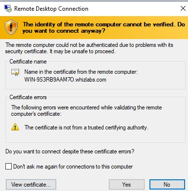
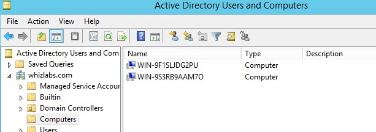

 

  
  <h3 align="center">100 days in Cloud</h3>

   AWS Directory Service - Working with Simple AD
     
    Lab 22
     
  

  
<h2 style="display: inline-block">Lab Details</h2>

  <ol>
    <li><a href="#services-covered">Services covered</a>
    <li><a href="#lab-description">Lab description</a></li>
    </li>
    <li><a href="#lab-date">Lab date</a></li>
    <li><a href="#prerequisites">Prerequisites</a></li>    
    <li><a href="#lab-steps">Lab steps</a></li>
    <li><a href="#lab-files">Lab files</a></li>
    <li><a href="#acknowledgements">Acknowledgements</a></li>
  </ol>

---

## Services Covered
*  **VPC**
*  **Directory Service**

---

## Lab description

***Creating a Simple AD may inflict some costs - I did my lab in whizlabs sandbox to avoid extra costs.***

---

### Learning Objectives
* Creating Simple Active Directory
* Creating DHCP Option Set for the VPC that the directory is in
* Creating and Configure Active Directory Server
* Setting up VPC, subnets, route table and IGW for Simple AD
* Adding a computer to Active Directory Server

### Lab date
09-12-2021

---

### Prerequisites
* AWS account
* Remote Desktop application installed

---

### Lab steps
1. Create an IAM Role to work with Active Directory. Attach **AmazonSSMManagedInstanceCore** and **AmazonSSMDirectoryServiceAccess** permissions to it. 

   

2. Create a VPC with **IPv4 CIDR block** **10.0.0.0/16**. Enable DNS hostname against this VPC which we will be using to RDP to the instance where AD will be configured. Select the created VPC and click on Actions menu and select Edit DNS hostnames.

   

3. Create two subnets in your VPC in two different AZ's. Use a AZ and provide **10.0.1.0/24** as IPv4 CIDR block and **10.0.2.0/24** for the second one.

   

   **Enable auto-assign public IPv4 address** for both subnets.

4. Create a Route Table in your VPC and Internet Gateway and attach it to your VPC. Add a route in the Route table:

   

   Add Subnet associations to the route table.

   

5. Set up a a Simple AD Directory in the Directory Service. Choose Simple AD, size small, later choose your VPC and subnets created in previous steps.

   

   This can take up to 5-10 minutes. Once the directory is created, click the **Directory ID** copy the **DNS address** which we require when working with **DHCP Option Set**.

   

6. Navigate to VPC dashboard and then **DHCP Option Sets** and create a new set. Enter values accordingly and use the DNS addresses from previous step. Then go to your VPC and select it and choose *Actions* then *Edit DHCP options set*. 

   

   There select the one that you just created.

7. Create and launch an EC2 instance running **Microsoft Windows Server 2012 R2 Base** on t2.micro, in the custom VPC your created in one of the subnets. Under *Domain join directory* choose the name you provided during Simple AD creation and use the Role created in step 1. Create a new security group with the provided defaults for RDP. You won't need key pair. When the instance is in *running* state select it and note the details.

8. Once the EC2 instance is launched and the status turns to “**Running**”, click the check-box next to the server name and copy the **Public IPv4 DNS** displayed in the details. Open the RDC app and provide the connection details.

   

   If the entered credentials are correct, the below screen will be displayed, and click the Yes button to login to the machine (Simple AD Server).

   

   The server might need couple of minutes to get ready, though. 

9. Once logged into the EC2 instance, Open **Control Panel** → **System and Security** → **System**. Under Computer name, domain, and workgroup settings we find the domain as you provided. Once the system gets ready, we need to install **Active Directory Administrative Tools**

   

10. Before adding Users / Groups, disconnect from the Active Directory server, select the server  and reboot it, then log in again (you might need to wait for couple of minutes). When logged in Click on **Start** → **Administrative Tools** → Administrative Tools Double click on the **Active Directory Users and Computers**, and new user.

    

    If you wish you can proceed and add that user to Remote Desktop Users and use RDP to connect with it's credentials.

11. Add one more machine to Active Directory Server as in step 7 but in another subnet. It will show up in the AD server:

    

### Lab files

* 
---

### Acknowledgements
* [whizlabs](https://play.whizlabs.com/site/task_details?lab_type=1&task_id=236&quest_id=35)

