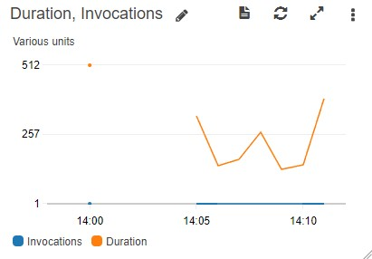

<br />

<p align="center">
  <a href="img/">
    
  </a>
  <h3 align="center">100 days in Cloud</h3>
<p align="center">
    Scheduling Lambda using EventBridge
    <br />
    Lab 50
    <br/>
  </p>


</p>

<details open="open">
  <summary><h2 style="display: inline-block">Lab Details</h2></summary>
  <ol>
    <li><a href="#services-covered">Services covered</a>
    <li><a href="#lab-description">Lab description</a></li>
    </li>
    <li><a href="#lab-date">Lab date</a></li>
    <li><a href="#prerequisites">Prerequisites</a></li>    
    <li><a href="#lab-steps">Lab steps</a></li>
    <li><a href="#lab-files">Lab files</a></li>
    <li><a href="#acknowledgements">Acknowledgements</a></li>
  </ol>
</details>

---

## Services Covered
*  **VPC**
*  **CloudWatch**
*  **EventBridge**
---

## Lab description

In this Lab I will create a Lambda function. Then I will configure EventBridge to create events that will trigger that Lambda function on schedule. Finally, I will verify that my Lambda function is being triggered using CloudWatch.

---

### Learning Objectives

* Create Lambda functions
* Run Lambda functions on a schedule using EventBridge
* Monitor Lambda functions using CloudWatch

### Lab date
11-11-2021

---

### Prerequisites
* AWS account

---

### Lab steps
1. Start with creating a Lambda function. Choose Python as runtime. Use the following code, it'll fetch provided website ('URL') and search for a word on it ('TEXT')

   ```python
   from urllib.request import urlopen
   
   URL = 'https://cloudacademy.com'
   TEXT = 'AWS'
   
   def lambda_handler(event, context):
       print('Event: %s' % event)
       t = event.get('time') or "?"
       with urlopen(URL) as u:
           output = u.read().decode('utf-8')
           if output:
               if TEXT in output:
                   return "SUCCESS at %s" % t
   
       print('%s not found in %s at %s' % (TEXT, URL, t))
       return "FAILURE"
   ```

   

2. Navigate to EventBridge and create a Rule. Define the scheduled pattern with a fixed rate of 1 minute. Use the default event bus. As a target choose the lambda from previous step. 

3. In order to verify the set-up go to **CloudWatch Metrics** and choose *All metrics*, then type name of your function in and choose Lambda by function name. Then display Invocations. Then switch to **Graphed metrics** and change period to 1 minute. 

   

4. Create a Dashboard in CloudWatch. Select Line type, configure it to show the lambda function and choose which metrics you want to show for example invocations and duration of execution

   
---

### Lab files
* 
---

### Acknowledgements
* [cloud academy](https://cloudacademy.com/lab/aws-lambda-scheduled-events/)

