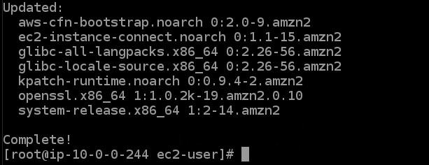
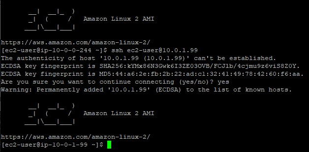
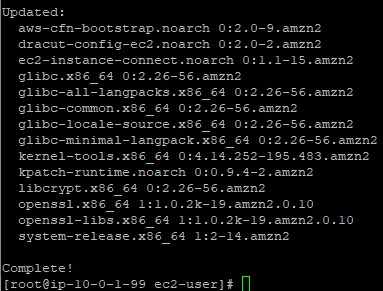

<br />

<p align="center">
  <a href="img/">
    
  </a>
  <h3 align="center">100 days in Cloud</h3>
<p align="center">
    NAT Gateway for an Instance in private subnet
    <br />
    Lab 56
    <br />
  </p>


</p>

<details open="open">
  <summary><h2 style="display: inline-block">Lab Details</h2></summary>
  <ol>
    <li><a href="#services-covered">Services covered</a>
    <li><a href="#lab-description">Lab description</a></li>
    </li>
    <li><a href="#lab-date">Lab date</a></li>
    <li><a href="#prerequisites">Prerequisites</a></li>    
    <li><a href="#lab-steps">Lab steps</a></li>
    <li><a href="#lab-files">Lab files</a></li>
    <li><a href="#acknowledgements">Acknowledgements</a></li>
  </ol>
</details>

---

## Services Covered
*  **EC2**
*  **VPC**
---

## Lab description

In this lab I will create a new **VPC** with a **private and public subnets**. Then I will launch a host bastion in public subnet and another instance in the private one. Both subnets will have route table associated with them. Instance on hte public subnet route will have internet access through the **internet gateway**. The instance in private subnet will have inbound internet traffic through the **NAT device**. In addition to security groups, the private subnet also has a **network access control list (NACL)** as an added measure of security.

---


### Learning Objectives

* Creating VPC
* Create a subnets and an internet gateway
* Configure routing for your VPC using a route table
* Create and manage an EC2 instance and an associated Elastic IP Address (EIP) within your VPC
* Create NACL and NAT Gateway

### Lab date
05-11-2021

---

### Prerequisites
* AWS account
* PuTTY for SSH connection

---

### Lab steps
1. Create Internet Gateway a **VPC** with a **CIDR block**: ***10.0.0.0/16\***.

2. Create public and private subnets in VPC created in step 1. The first one will be public with CIDR block:***10.0.0.0/24***. When created, mark that subnet and go to *Actions*, click on *Modify auto-assign IP settings* and enable auto-assign of IPv¤ public address. Create one more subnet, this time private one.

   

3.  Create Internet Gateway then attach it to the VPC.

4. Create Public Route Table. When created within your VPC add route to the IGW from step 2. Associate the public subnet with the route table. Go to *Subnet associations* and edit it so it's associated with public subnet.

   

   

   Now the Instances launched within MyPublicSubnet will have access to the Internet.

5. Launch an EC2 Instance in Public Subnet. Choose Linux 2 AMI and t2.micro. Choose your **VPC** and public subnet. Auto-assign Public IP select Use Subnet Setting (Enable). Create a security group that will allow traffic on port 22 SSH from anywhere.

6. Launch an EC2 Instance in Private Subnet with similar settings but the subnet. Attach the SG from previous step. You should now have two instances:

   

7. SSH into Public and Private EC2 Instance and Test Internet Connectivity. SSH into MyPublicEC2Server Instance. Run the updates using the following command:

   ```
   sudo su
   yum -y update
   ```

   Since the Internet Gateway MyIGW is connected to MyPublicSubnet, updates will be completed successfully.

   

8. SSH into MyPrivateEC2Server from MyPublicEC2Server. You'll need the key on the public Instance or use PuTTY and Pageant with key agent.

   

   If you'd try to the private instance it would timeout since it has no internet access.

9. Create a NAT Gateway. Navigate to the VPC Page in the public subnet with an Elastic IP.

   

10. Update Route table and configure NAT Gateway. In **Route Tables** select the Main Route Table for your VPC and attach Nat Gateway.

    

    And add route to NAT Gateway

    

    Now the Instances launched within MyPrivateSubnet can access the Internet through the NAT Gateway.

11. Test Internet connection from Instance inside Private Subnet. Now if you run 

    ```
    sudo su
    yum -y update
    ```

    The private instance should have the internet access.

    

---

### Lab files
* 
---

### Acknowledgements
* [whizlabs](https://play.whizlabs.com/site/task_details?lab_type=1&task_id=35&quest_id=35)

