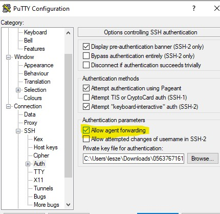
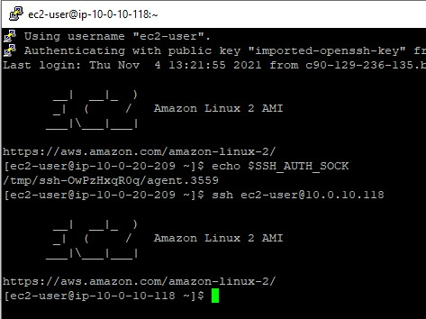

<br />

<p align="center">
  <a href="img/">
    
  </a>
  <h3 align="center">100 days in Cloud</h3>
<p align="center">
    Securing VPC using Public and Private Subnets
    <br />
    Lab 57
    <br />
  </p>


</p>

<details open="open">
  <summary><h2 style="display: inline-block">Lab Details</h2></summary>
  <ol>
    <li><a href="#services-covered">Services covered</a>
    <li><a href="#lab-description">Lab description</a></li>
    </li>
    <li><a href="#lab-date">Lab date</a></li>
    <li><a href="#prerequisites">Prerequisites</a></li>    
    <li><a href="#lab-steps">Lab steps</a></li>
    <li><a href="#lab-files">Lab files</a></li>
    <li><a href="#acknowledgements">Acknowledgements</a></li>
  </ol>
</details>

---

## Services Covered
*  **EC2**
*  **VPC**
---

## Lab description

In this lab I will create a new **VPC** with a **private and public subnets**. Then I will launch a host bastion in public subnet and another instance in the private one. Both subnets will have route table associated with them. Instance on the public subnet route will have internet access through the **internet gateway**. The instance in private subnet will have inbound internet traffic through the **NAT device**. In addition to security groups, the private subnet also has a **network access control list (NACL)** as an added measure of security.

---


### Learning Objectives

* Create VPC
* Create a subnets and an internet gateway
* Configure routing for your VPC using a route table
* Create and manage an EC2 instance and an associated Elastic IP Address (EIP) within your VPC
* Create NACL and NAT Gateway

### Lab date
04-11-2021

---

### Prerequisites
* AWS account
* PuTTY for SSH connection

---

### Lab steps
1. Create a **VPC** with CIDR block: *10.0.0.0/16* and *default* tenancy.

2. Navigate to **Internet Gateways** and create a new one. Then attach it to the VPC from previous step.

3. Next create a **Subnet** in your VPC. This one will be public so give it an adequate name. Choose one AZ and provide CIDR block: *10.0.20.0/24*.

4. Go to **Route Tables** and create a new one in your VPC. When created click on *Edit routes* and add route: Destination: Enter 0.0.0.0/0 and as target choose the earlier created Internet Gateway.

5. Navigate back to **Subnets** and choose the public one created in previous step. Then click the *Route table* tab then *Edit route table association* and as *Route table ID* choose the one created in step 4.

6. Create a basion host by creating a **EC2** Linux instance. In *Instance Details* tab for **Network** choose the VPC created in first step, as subnet the public one from step 2 and **Enable Auto-assign Public IP**. Create a new security group that will allow SSH inbound and as source: **MyIP**.

7. Now create a private **Subnet**. Go to **VPC** dashboard and create a subnet within your VPC, give it a name indicating that it'll be a private one, choose an AZ and as CIDR block enter *10.0.10.0/24*.

8. Then create a **Route table** in your VPC. Next edit routes and add a route with destination *0.0.0.0/0* and target the **Internet Gateway** from step 2. *This is a temporary target value. Later in this lab, you will add a NAT device (gateway or instance) and update the **Target** for the **PrivateRouteTable** to the NAT device.* Now you should have two subnets one called *Private* and one *Public*:

   

   Choose the *Private* one and *Edit route table association* by changing the **Route table ID** to the one created earlier in this step

   

9. Create a **Network Access Control List** for your private subnet. Navigate to **Networks ACLs** and create a new one with name indicating that it'll be for a private subnet. When created go to **Subnet associations** and associate it with the private subnet

   

10. Create inbound and outbound rules for your private Network Access Control List (NACL). Select it and go to **Inbound rules** tab and then edit. Add two new rules as pictured under

    

    Then edit outbound rules as follows:

    

11.  Launch an instance in a private subnet created earlier, that would match a database instance in real life deployment. In **EC2 Dashboard** launch a new instance in your VPC ans select **Private** subnet, no need for public IP. Create a **Security group** that will allow inbound SSH request from bastion host only. As a source of SSH choose the Custom and bastions security group.

    You should have two instances, you might change their names for clarity:

    

12. Go to **Security groups** tab and choose the bastions SG. Edit it outbound rule and restrict it to the private SG for SSH.

13. Connect to your bastion instance using for example PuTTY and Pageant and remember to check **Allow agent forwarding** in order to be able to connect to the private instance.

    

    When connected to bastion host use SSH to connect to the private instance.

    

    Now you should be in in the private instance, but if try to run

    ```
    sudo yum update
    ```

    The instance won't be able to access the internet.

14. In this lab step, you will create a NAT Gateway that will be used by the EC2 instance in your private subnet to access the public internet. Navigate to **VPC** click **NAT Gateways** and create a new one. As subnet choose the **Public** one and Connectivity type: Ensure Public is selected. Then allocate Elastic IP.

    

    When NAT Gateway's state becomes available go to **Route Tables** select the one for private subnet end edit routes. Change the one with destination set to 0.0.0.0/0 to have NAT Gateway as target

    

15. Now if you try to run yum update on your private instance it should have internet connection

    

16. 

---

### Lab files
* 
---

### Acknowledgements
* [cloud academy](https://cloudacademy.com/lab/introduction-virtual-private-cloud-vpc/?context_id=954&context_resource=lp)

