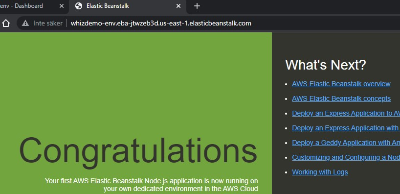
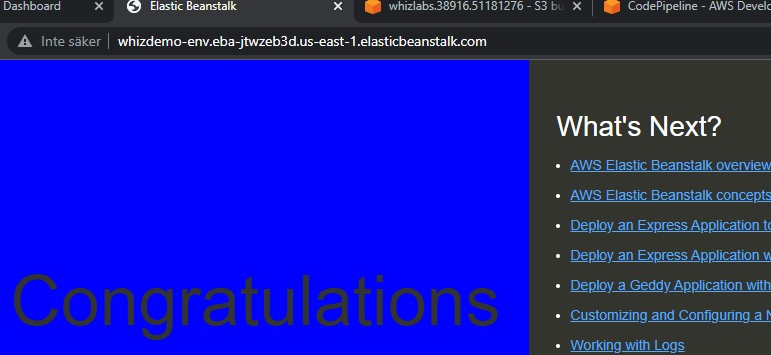

 

  
  <h3 align="center">100 days in Cloud</h3>

    Creating Elastic Beanstalk App and deploying code using CodePipeline
     
    Lab 60
     
  

  
<h2 style="display: inline-block">Lab Details</h2>

  <ol>
    <li><a href="#services-covered">Services covered</a>
    <li><a href="#lab-description">Lab description</a></li>
    </li>
    <li><a href="#lab-date">Lab date</a></li>
    <li><a href="#prerequisites">Prerequisites</a></li>    
    <li><a href="#lab-steps">Lab steps</a></li>
    <li><a href="#lab-files">Lab files</a></li>
    <li><a href="#acknowledgements">Acknowledgements</a></li>
  </ol>

---

## Services Covered
*  **Elastic Beanstalk**
*  **Code Pipeline**
*  **S3**
---

## Lab description
This lab walks you through the Deployment of sample Node.js application in Elastic Beanstalk. Then the code gets updated, uploaded into S3 bucket and used as a source for CodePipeline pipeline. The pipeline will deploy the updated code into a Elastic Beanstalk Environment and update the running app.

---

### Learning Objectives

* Create Elastic Beanstalk Environment
* Create a CodePipeline pipeline
* Test the application deployment changes

---

### Lab date
01-11-2021

---

### Prerequisites
* AWS account

---

### Lab steps
1. Create Elastic Beanstalk Environment. Choose **Node.js** as Platform and use sample application. This will create a sample node.js app.

   
   
2. Navigate to S3 and enable versioning for a new bucket. Then upload the updated version of the application. In my case it's just changed background color of this app. You'll find the update files [here](https://github.com/CloudedThings/100-Days-in-Cloud/tree/main/Labs/60-Elastic-Beanstalk-and-CodePipeline/nodejs-v2-blue). Then copy the object key. 

3. Create a CodePipeline pipeline. As a source provider choose Amazon S3. Then the bucket with the updated app and it's key. Skip build stage. As a deploy provider choose Elastic Beanstalk and choose the earlier created environment. 

   Immediately after creation, the pipeline will start running, Once the source is verified, the first section **Source** will be shown as Succeeded.

   

4. Test the application deployment changes. Go back to Elastic Beanstalk. The application should've been updated

   

   Navigate to the provided link and you should see the changes:

   

   

---

### Lab files
* [nodejs-v2-blue](https://github.com/CloudedThings/100-Days-in-Cloud/tree/main/Labs/60-Elastic-Beanstalk-and-CodePipeline/nodejs-v2-blue) - updated version of the app, used as a source for Pipeline
---

### Acknowledgements
* [cwhizlabs](https://play.whizlabs.com/site/task_details?lab_type=1&task_id=204&quest_id=36)

