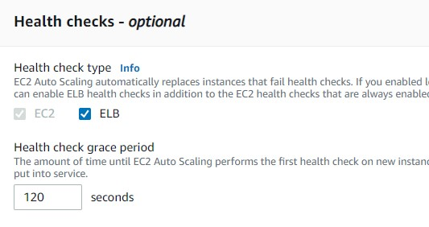
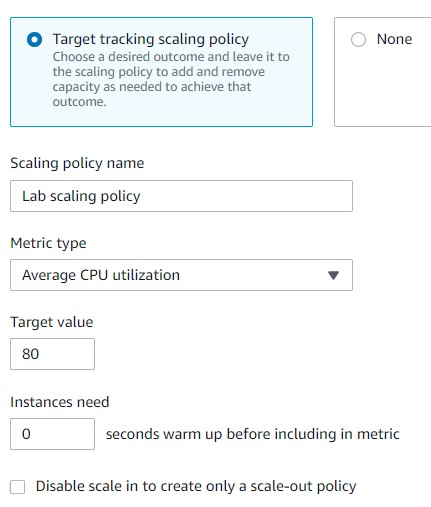

<br />

<p align="center">
  <a href="img/">
    
  </a>
  <h3 align="center">100 days in Cloud</h3>
<p align="center">
    Amazon EC2 Auto Scaling Groups and Application Load Balancer
    <br />
    Lab 64
    <br />
  </p>


</p>

<details open="open">
  <summary><h2 style="display: inline-block">Lab Details</h2></summary>
  <ol>
    <li><a href="#services-covered">Services covered</a>
    <li><a href="#lab-description">Lab description</a></li>
    </li>
    <li><a href="#lab-date">Lab date</a></li>
    <li><a href="#prerequisites">Prerequisites</a></li>    
    <li><a href="#lab-steps">Lab steps</a></li>
    <li><a href="#lab-files">Lab files</a></li>
    <li><a href="#acknowledgements">Acknowledgements</a></li>
  </ol>
</details>

---

## Services Covered
*  **EC2**
*  **Application Load Balancer**

---

## Lab description

In this lab I will create an **Auto Scaling Group** and place it behind an **Application Load Balancer**. Instances will be deployed within a Target Group. Each Instance will run an Apache server and will be stressed to cause spike in CPU utilization above threshold. That will cause Instances to fail Health Checks which will trigger replacement of the unhealthy one with a new one.

### Learning Objectives

* Create and configure an Application Load Balancer
* Create and configure Auto Scaling groups and launch templates
* Utilize Auto Scaling to ensure application availability
* Stress test Instances using **stress** tool

---


### Lab date
28-10-2021

---

### Prerequisites
* AWS account

---

### Lab steps
1. Start with creating a **Load Balancer** of type ALB. It'll be **Internet-facing** and **IPv4**. Create a new Security Group that will allow all inbound HTTP traffic from anywhere.  

   

   Back in ALB creation tab attach that SG to Load Balancer.

2. In the **Listeners and routing** click the **Create target group** link. Use the default values and give it a name. Back in ALB tab choose the TG. Listener should be set as HTTP on port 80. Then **Create load balancer**.

3. Create a **Security Group** for instances. This group will need inbound rules for both SSH and HTTP from anywhere since it'll be attached to instances for a webserver cluster.

4. Create **Launch Template**. As AMI choose Amazon LInux 2, Instance type t2.micro, choose or create a Key pair. Then attach the earlier created security group. Then in Advanced details enable **Detailed CloudWatch monitoring**.

   

   The provided user data will install PHP, an Apache webserver and a tool for stress testing.

   ```
   #!/bin/bash
   
   sudo amazon-linux-extras install epel
   
   sudo yum install -y httpd php
   
   service httpd start
   
   sudo yum install -y stress
   
   ```

5. Create an **Auto Scaling Group**. As a **Launch template** choose the one created in previous step. For the Network options choose Subnet available in drop-down menu. On next page **Attach to an existing load balancer** choose the one created earlier. Add *optional* **Health checks** on ELB every 120 seconds.

   

   Enable group metrics collection within CloudWatch. On the next page change the **Maximum capacity** value to 5. **Scaling policies** - *optional* select **Target tracking scaling policy** with Target value for *Average CPU utilization* of value 80.

   

   Continue further and **Create Auto Scaling group**. This will launch one Instance.

   

6. Continue to Load Balancer and copy the DNS name in browser

   

7. In this step launch **stress** tool to observe the **Auto scaling group** scale-out. Connect to the Instance using **EC2 Instance Connect**. To start a stress test that will increase CPU utilization run:

   ```
   stress --cpu 2 --io 1 --vm 1 --vm-bytes 128M --timeout 5m
   ```

   Go back to Instance and choose **Monitoring**, choose **View in metrics** which will open CloudWatch. Change Period to 1 minute. The CPU utilization will spike and after 2 minutes the instance will fail a Health Check and a new one will replace it.

   

   


### Lab files
* 
---

### Acknowledgements
* [cloud academy](https://cloudacademy.com/lab-challenge/amazon-s3-and-aws-lambda-challenge/)

