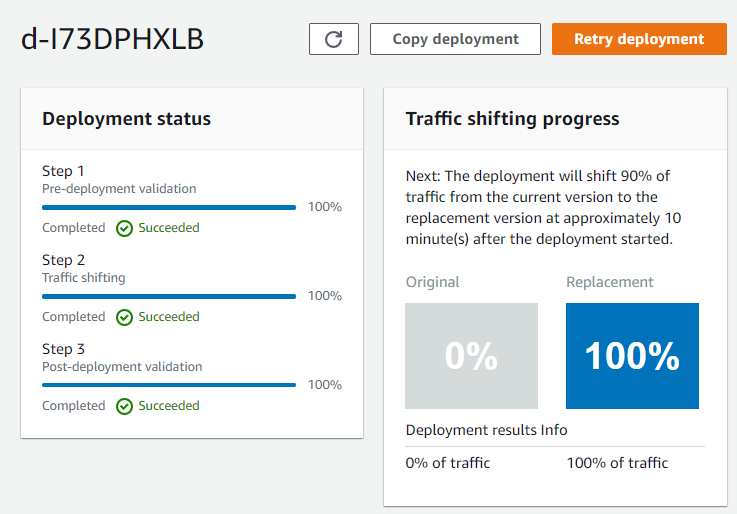

<br />

<p align="center">
  <a href="img/">
    
  </a>

  <h3 align="center">100 days in Cloud</h3>

<p align="center">
    Using SAM update Lambda functions with CodeDeploy
    <br />
    Lab 81
    <br />
  </p>

</p>

<details open="open">
  <summary><h2 style="display: inline-block">Lab Details</h2></summary>
  <ol>
    <li><a href="#services-covered">Services covered</a>
    <li><a href="#lab-description">Lab description</a></li>
    </li>
    <li><a href="#lab-date">Lab date</a></li>
    <li><a href="#prerequisites">Prerequisites</a></li>    
    <li><a href="#lab-steps">Lab steps</a></li>
    <li><a href="#lab-files">Lab files</a></li>
    <li><a href="#acknowledgements">Acknowledgements</a></li>
  </ol>
</details>

---

## Services Covered
*  **Lambda**

*  **SAM**

*  **CodeDeploy**

---

## Lab description
Using SAM deploy new version of Lambda using CodeDeploy. The CodeDeploy Canary Deployment will shift  10% of traffic for 10 minutes to new alias of Lambda function then it'll run tests and if passed shift whole traffic to the new alias. Sample template with resources will be used and above Lambda function and CodeDeploy, an API Gateway and IAM Roles will be created.


* **Create and build SAM package**
* **Deploy SAM package**
* **Trigger a new deployment of Lambda function using CodeDeploy**

---

### Lab date
11-10-2021

---

### Prerequisites
* AWS account
* SAM CLI [installed](https://docs.aws.amazon.com/serverless-application-model/latest/developerguide/serverless-sam-cli-install.html)

---

### Lab steps
1. Create a new application in the working folder by running this SAM command in console:

   ```bash
   sam init --runtime python3.9
   ```

   Then choose AWS Quick Start Templates ans package type *zip*. And then *Hello world Example* this will clone the app to local folder.

2. Go to *sam-app* folder and run:

   ```bash
   sam build
   ```

3. Go to [template.yaml](sam-app/template.yaml) and after Events add those lines of code:

   ```yaml
    AutoPublishAlias: live
         DeploymentPreference:
           Type: Canary10Percent10Minutes
   ```

   This will use CodeDeploy to switch from aliases of Lambda function in Canary type of deployment.

4. Re-run sam build after the code update.

   ```bash
   sam build
   ```

5. Time to deploy the build.

   ```
   sam deploy --guided
   ```

   This will create a changeset in CloudFormation and ask if you want to deploy all of the resources:

   

   So now Lambda function, API, CodeDeploy, IAM has been deployed. This environment is up and running.

6. Time to make some changes to the Lambda function code. Then again run the sam commands and deploy the updated package. When checking if the CodeDeploy Canary deployment is in progress it show that indeed it is, which will take 10 minutes as stated in sam template:

   

   After ten minutes of this canary traffic shifting it should go into Step and shift 100% of traffic to new Lambda alias.

   

7. The Lambda function has been shifted to the new version

   

8. Time for clean-up, run the delet command, that will delete the S3 bucket and the CloudFormation stack

   ```bash
   sam delete
   ```

   


---
### Lab files

* sam-app
* template.yaml

---

### Acknowledgements

* [AWS](https://docs.aws.amazon.com/serverless-application-model/latest/developerguide/serverless-getting-started-hello-world.html)

