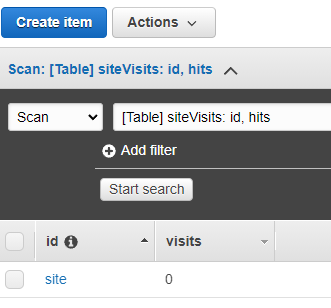

<br />

<p align="center">
  <a href="img/">
    
  </a>


  <h3 align="center">100 days in Cloud</h3>

  <p align="center">
    Website visitors counter backed with API Gateway, Lambda and DynamoDB
    <br />
    Lab 87
    <br />
  </p>


</p>

<details open="open">
  <summary><h2 style="display: inline-block">Lab Details</h2></summary>
  <ol>
    <li><a href="#services-covered">Services covered</a>
    <li><a href="#lab-description">Lab description</a></li>
    </li>
    <li><a href="#lab-date">Lab date</a></li>
    <li><a href="#prerequisites">Prerequisites</a></li>    
    <li><a href="#lab-steps">Lab steps</a></li>
    <li><a href="#lab-files">Lab files</a></li>
    <li><a href="#acknowledgements">Acknowledgements</a></li>
  </ol>
</details>

---

## Services Covered
*  **DynamoDB**
*   **Lambda**
*   **API Gateway**

---

## Lab description
In this lab I will create a backend of a website counter. It'll be backed with DynamoDB table, Lambda function and calls made to API. When API call is made a Lambda fuction will increment the value in the table and return the latest value.


* **Create a Lambda Function**
* **Create API Gateway**
* **Create DynamoDB Table**
* **Integrate API with Lambda function**

---

### Lab date
05-10-2021

---

### Prerequisites
* AWS account
* Postman

---

### Lab steps
1. Create a DynamoDB table, choose **On Demand** to lower the cost, but if you still are under free-tier choose **Provisioned**. Give your table a name and provide a **Primary key**. When table goes to **Active** status create a item in the table either programmaticly or through the console, the important part is that you provide your primary key and additional Attribute of type **Number** with some meaningful name for example _visits_. Set _visits_ to 0.

   

2. Create a Lambda function, choose Python as runtime engine. Create a new role for the function, it'll need the basic Lambda execution role and additional permissions to access DynamoDB table:

   ```
   {
       "Version": "2012-10-17",
       "Statement": [
           {
               "Sid": "VisualEditor0",
               "Effect": "Allow",
               "Action": [
                   "dynamodb:PutItem",
                   "dynamodb:GetItem",
                   "dynamodb:Query",
                   "dynamodb:UpdateItem"
               ],
               "Resource": "<DYNAMODB_ARN>"
           }
       ]
   }
   ```

   As a safty measure create **Environment variable** for you database name under the **Configuration** tab.

   

   The following code will increment the _visits_ attribute each time the function is invoked and return the latest value. It includes the HTTP headers for the API calls.

   ```python
   import boto3
   import os
   import json
   from boto3.dynamodb.conditions import Key
   
   ddbName = os.environ["dbName"] // get table name from Environment Variables
   
   dynamodb = boto3.resource('dynamodb')
   table = dynamodb.Table(ddbName) 
   
   // returns the latest value
   def get_count():
       response = table.query(
           KeyConditionExpression=Key('id').eq('site')
           )
       count = response['Items'][0]['visits']
       return count
   
   // increment the visits value
   def lambda_handler(event, context):
       response = table.update_item(     
           Key={        
               'id': 'site',
               'hits': 0
           },   
           UpdateExpression='ADD ' + 'visits' + ' :incr',
           ExpressionAttributeValues={        
               ':incr': 1   
           },    
           ReturnValues="UPDATED_NEW"
       )
       
   // Headers for API calls
       return {
           'statusCode': 200,
           'headers': {
               'Access-Control-Allow-Origin': '*',
               'Access-Control-Allow-Headers': 'Content-Type,X-Amz-Date,Authorization,X-Api-Key,X-Amz-Security-Token',
               'Access-Control-Allow-Credentials': 'true',
               'Content-Type': 'application/json'
           },
           'body': get_count()
       }
   
   ```

   

   Go ahead and test the function and check if the _visits_ attribute gets changed.

3. Create an API Gateway, choose REST API. Create new POST method with **Lambda function** Integration type, choose the earlier created function. Then test it and check if the DynamoDB table have been updated.

4. Deploy the API. From **Actions** drop-down menu click on **Deploy API**. You will see the **Invoke URL**, you can copy it and test it with a tool like Postman. There's not much going on there yet, but the API responds with the latest value:

   

   The response is obviously in line with the item value in the table:

   

   I will include this on my website in upcoming lab. 
---
### Lab files

* [lambda.py]()

---

### Acknowledgements


