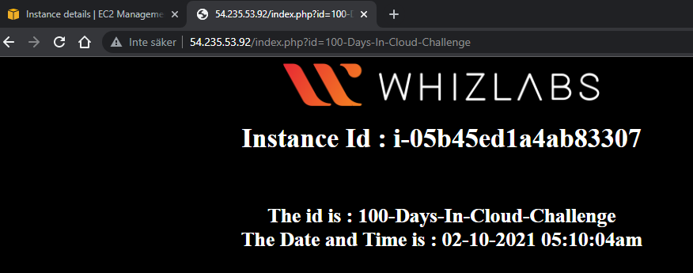
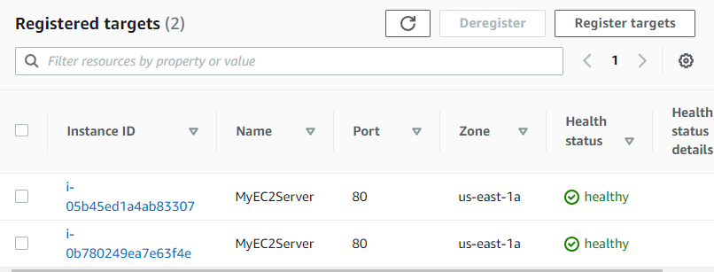
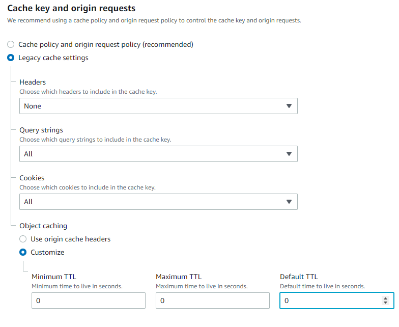

<br />

<p align="center">
  <a href="/img/">
    
  </a>


  <h3 align="center">100 days in Cloud</h3>

  <p align="center">
    Using CloudFront build a distribution for a dynamic website
    <br />
    Lab 90
    <br />
  </p>


</p>

<details open="open">
  <summary><h2 style="display: inline-block">Lab Details</h2></summary>
  <ol>
    <li><a href="#services-covered">Services covered</a>
    <li><a href="#lab-description">Lab description</a></li>
    </li>
    <li><a href="#lab-date">Lab date</a></li>
    <li><a href="#prerequisites">Prerequisites</a></li>    
    <li><a href="#lab-steps">Lab steps</a></li>
    <li><a href="#lab-files">Lab files</a></li>
    <li><a href="#acknowledgements">Acknowledgements</a></li>
  </ol>
</details>

---

## Services Covered
*   **CloudFront**
*   **ELB**

---

## Lab description
In this lab a CloudFront distribution will be created, that will distribute a publicly accessible dynamic PHP page. The distribution will deliver contents of a Application Load Balancer from 2 EC2 Instances which host a PHP webpage. Tasks:

* **Create EC2 Instances, launch them with Bash script**
* **Create Application Load Balancer**
* **Create a Targer Group**
* **Create a CloudFront Distribution**

---

### Lab date
02-10-2021

---

### Prerequisites
* AWS account

---

### Lab steps
1. Start with launching two EC2 Linux 2 AMI Instances of type t2.micro. Add **User data**:

   ```bash
   #!/bin/bash
   
   sudo su
   
   yum update -y
   
   yum install httpd php -y
   
   systemctl start httpd
   
   systemctl enable httpd
   
   cd /var/www/html/
   
   wget https://labtask185.s3.amazonaws.com/index.php
   
   systemctl restart httpd
   ```

   This will install php server called httpd start it and set an index page. 

   Create a new security group that allow SSH, HTTP and HTTPS traffic from anywhere. We won't be needing security keys for this lab.

2. Go to the instances public IPv4 address, for example:

   ```
   http://54.235.53.92/index.php
   ```

   You can pass a query string parameter **id** and the value will be displayed in the page:

   ```
   http://54.235.53.92/index.php?id=100-Days-In-Cloud-Challenge
   ```

   

   Similar thing should work for on the second instance:

   

3. Create a Target Groups. Under **Basic configuration** select **Instances**, give a name, choose HTTP as protocol and default VPC. Configure health check path as **/index.php**. 

   Register the earlier created Instances as targets. 

4. Create an Application Load Balancer, **Internet-facing**, IP address type: **IPv4**, Default VPC and mapping in all available zones. Remove the default security group and select the one created earlier. Select listener as the Target Group created earlier. 

   

   Now the Load Balancer has a DNS name that you can navigate to and it'll will equally split the traffic between the two instances.

5. Create the CloudFront Distribution. Choose the **Load balancer** name as a Origin domain. Leave all as default and scroll down to 

   TTL option to be disabled for dynamic contents, since our site accepts the query string parameter **id**. Click on the **Create distribution**. This process might take a while. When done you will be able to test the **Distribution domain name**

   

6. Now that the distribution is deployed it's time for a clean-up. Delete EC2 Instances, Load Balance and CloudFront distribution.

   
### Lab files

* None

---

### Acknowledgements
* [whizlabs](https://play.whizlabs.com/site/task_details?lab_type=1&task_id=185&quest_id=31)

